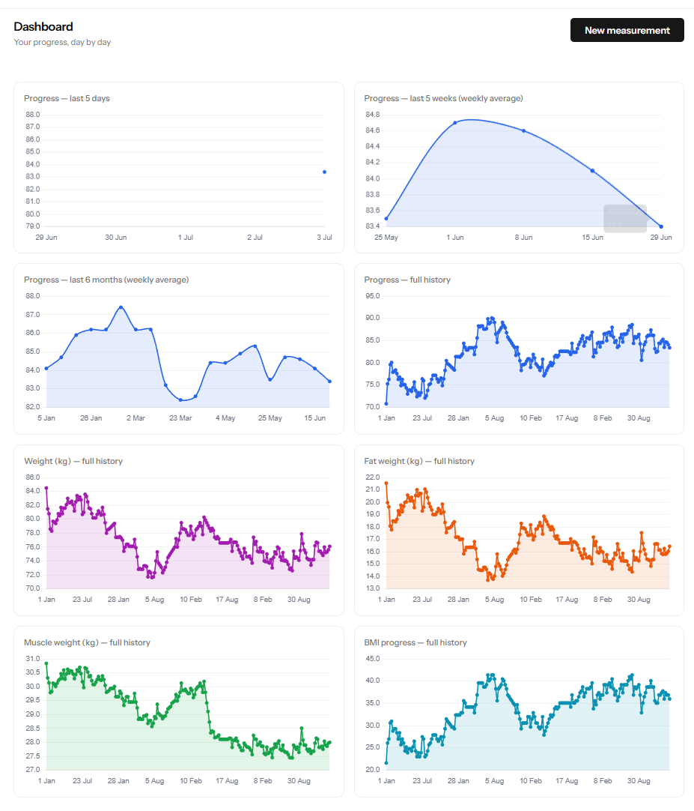
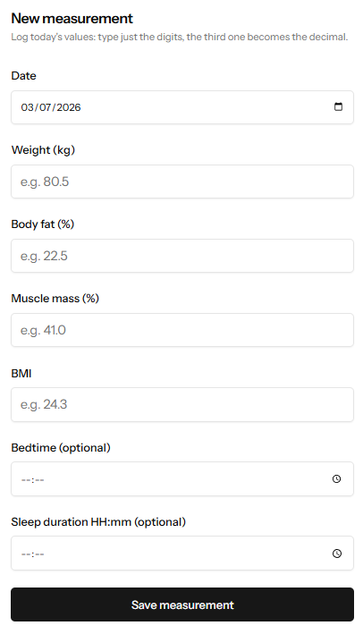
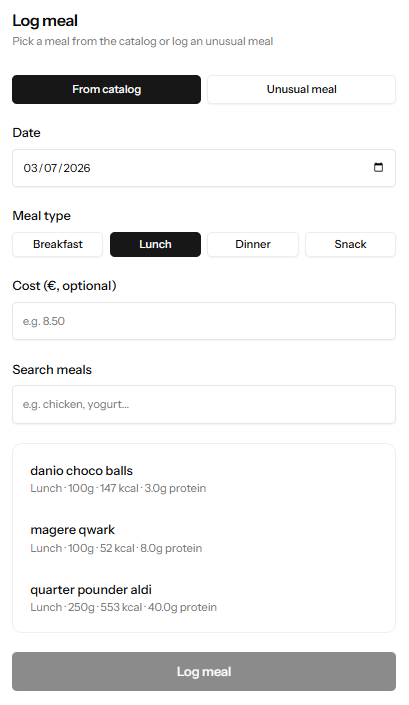

# EasyFit

A personal app for tracking body weight, nutrition, and fitness goals, day by day.

## Screenshots

| Dashboard | New measurement | Log meal |
| --- | --- | --- |
| [](docs/screenshots/dashboard.png) | [](docs/screenshots/new-measurement.png) | [](docs/screenshots/log-meal.png) |

## Features

**Body measurements**
- Daily entry form (weight, body fat %, muscle %, BMI, bedtime and sleep duration), designed to
  be filled in a few seconds every day.
- Derived metrics: progress, BMI progress, fat weight, muscle weight, and an improvement
  indicator relative to the previous measurement.
- Full, editable history, ordered newest first.
- Dashboard with 8 charts (progress over the last 5 days/5 weeks/6 months, full history of
  progress/weight/fat weight/muscle weight/BMI progress), plus dedicated full-page views for
  each.

**Meals**
- A personal catalog of reusable meals (description, type, reference weight, calories, protein).
- Register a meal either by picking it from the catalog — with automatic calorie/protein
  recalculation if you change the portion — or as a one-off "unusual meal" with manually entered
  values (with the option to save it to the catalog for next time).
- Daily view with totals for calories, protein, and cost.
- A management page listing the full history of registered meals, each individually editable.
- Optional cost per meal, with a daily total.

**Goals**
- Configurable thresholds (max body fat %, min protein per day, max calories per day and per
  week), all optional.
- A visual comparison (green/red) between the day's totals and the configured thresholds, hidden
  entirely when a threshold hasn't been set.

## Tech stack

- **Backend**: Laravel 13, PHP 8.3+, Fortify (authentication, 2FA, passkeys)
- **Frontend**: Vue 3 + Inertia.js v3, Tailwind CSS 4
- **Typed routing**: Laravel Wayfinder
- **Testing**: Pest 4
- **Database**: SQLite (default)

## Requirements

- PHP >= 8.3
- Composer
- Node.js + npm
- Laravel Herd (or an equivalent local environment)

## Installation

```bash
composer install
cp .env.example .env
php artisan key:generate
php artisan migrate
npm install
npm run build
```

To seed the database with realistic demo data (measurements and meals over the last ~90 days):

```bash
php artisan db:seed
```

## Development

```bash
composer run dev   # Artisan server + queue listener + Vite, all in parallel
```

Or, if the app is served by Laravel Herd, `npm run dev` is enough for the frontend.

## Tests and code quality

```bash
php artisan test --compact       # Pest suite
vendor/bin/pint                  # PHP formatting
vendor/bin/phpstan analyse       # static analysis
npm run lint                     # ESLint
npm run types:check              # TypeScript type checking (vue-tsc)
```
